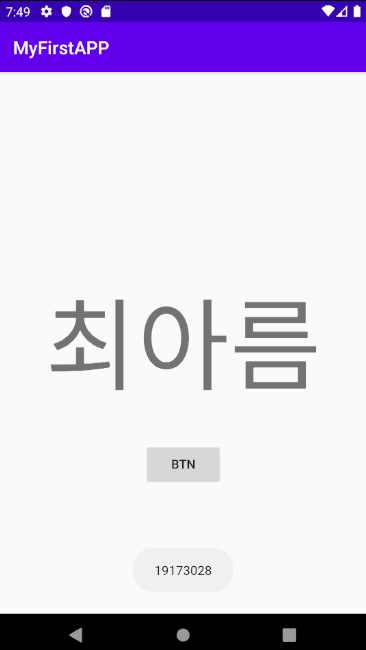

# 19173028 최아름

## 1 주차 과제
퀴즈 풀기
## 2 주차 과제
</img>

## 3주차 과제
</img> </img> </img>

## 4주차 과제
#### 맞춤 패션 앱 : 자신의 체형의 어울리는 옷이나 자신의 패션을 평가받는 앱
→ 외적으로 신경을 많이 쓰게되는 시대가 되면서 외모뿐만 아니라 패션에도 많은 관심을 가지게 되어 패션 유행이 날마다 바뀌거나 옷 가지수는 늘어나기 때문에 자신의 체형의 어울리는 옷, 상/히위 옷이 어울리는 패션을 못 찾는 경우가 많아지면서 패션에 대한 고민이 점차 늘어나기 때문에 생각한 앱입니다.
 
→ 자신의 체형을 캐릭터로 설정하고 옷을 골라서 캐릭터에게 입히고 저장한 다음 자신을 평가해 주는 게시판과 오늘의 패션이라는 가장 인기가 많은 패션을 순서대로 나열하는 게시판으로 올려 패션을 평가해 주거나 받는 앱 
 
→ 기능은 기본적으로 캐릭터를 제공하여 자신의 체형을 키, 몸무게, 피부 톤, 팔 길이, 다리 길이 등 설정 (숫자로 입력)하거나 조절 (마우스로 자유 자재로 늘리거나 사용할 수있는 기능) 할 수 있는 기능, 가장 많이 팔리는 상(옷, 모자)/하위(바지, 신발), 상/하위 무늬의 모양을 100가지이상 제공, 색상(전체 그리기, 부분 그리기), 악세사리 항목을 제공해 자신이 입고 갈 패션이나 사고 싶은 옷 등을 꾸며서 저장을 하고 평가해 주세요(자신이 꾸민 캐릭터를 올려서 사람들이 평가해주는 시스템/ 좋아요와 싫어요는 없고 댓글기능만 제공)라는 게시판과 오늘의 패션(자신이 꾸민 캐릭터를 올려 가장 많이 좋아요를 받은 순서로 나오는 시스템/ 싫어요와 댓글 기능은 없고 좋아요 기능만 제공 ) 게시판을 만든다. 또, 각 쇼핑몰마다 사이즈가 다르게 나오기 때문에 모든 쇼핑몰에서 기본적으로 나오는 사이즈를 상위(어깨단면, 가슴단면, 소매길이, 암홀단면, 소매단면), 하위(허리단면, 힙단면, 허벅지단면, 밑단단면, 밑위)를 설정하면 자신이 맨 처음 캐릭터를 설정했을 때의 사이즈와 쇼핑몰 사이즈를 비교해서 자신이 어떤 사이즈를 입어야 할지를 골라주는 시스템을 제공하는 앱이다.
1. 체형을 설정, 상/하위 꾸밀 수 있는 캐릭터
3. 평가받는 게시판/ 오늘의 패션
4. 쇼핑몰 사이즈와 내가 설정한 캐릭터의 체형 사이즈를 비교해서 자신이 입어야 할 쇼핑몰 사이즈 추천
